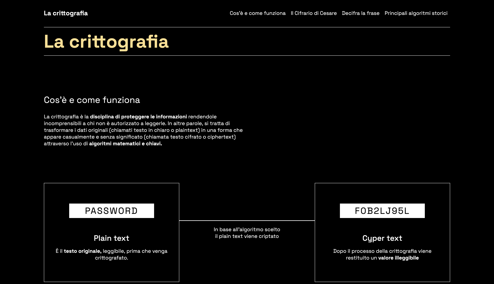
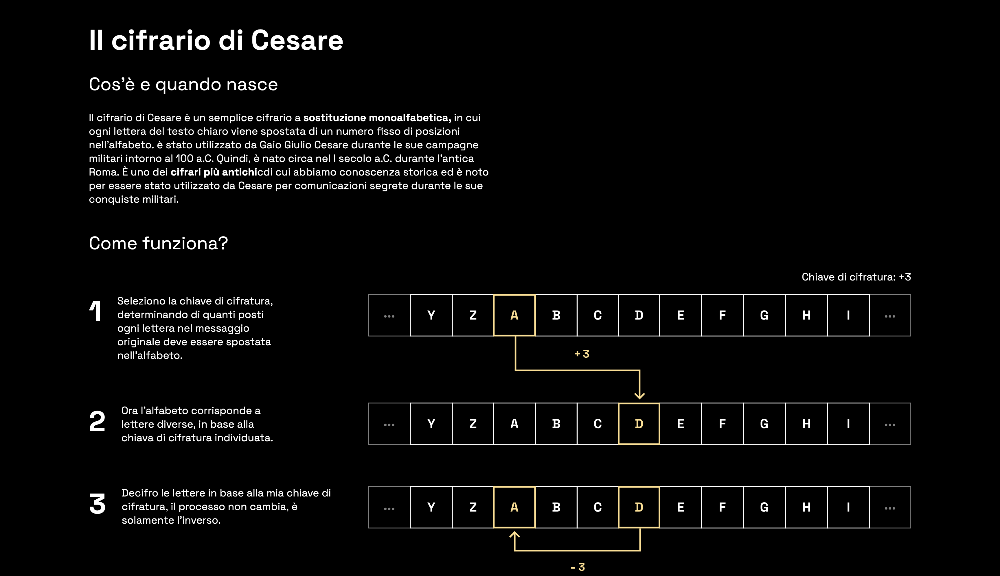
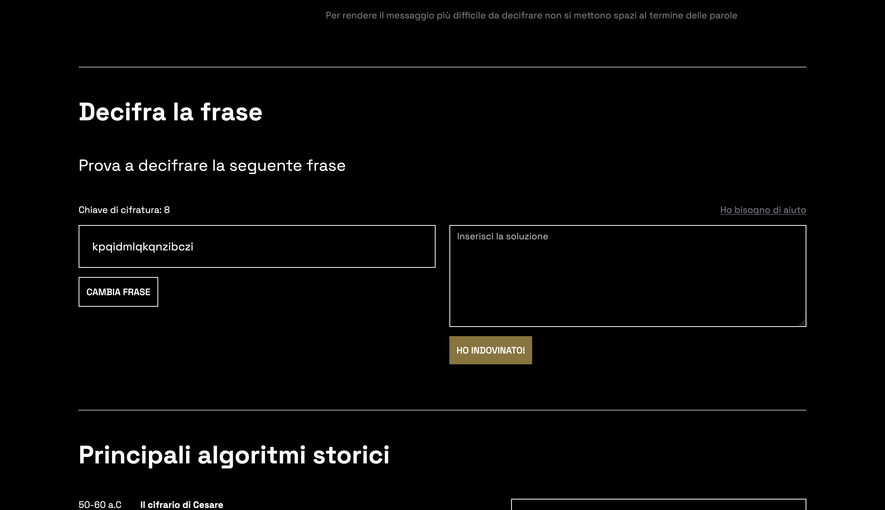
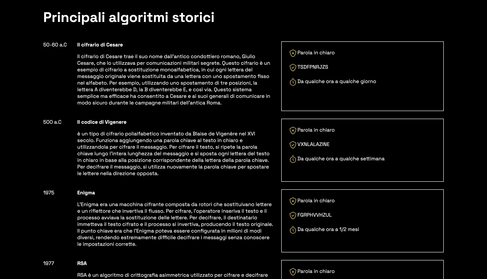

SUPSI 2023-24  
Corso d’interaction design, CV428.01  
Docenti: A. Gysin, G. Profeta  

Elaborato 2: Intermedio 

# Crittografia
Autore: Walter De Nicola<br>
[Crittografia](https://walterdn03.github.io/crittografia)


## Introduzione e tema
L'obiettivo era progettare  una pagina web che mostri come ha avuto origine e come funziona un algoritmo, in questo caso quello della crittografia


## Riferimenti progettuali
Durante la realizzazione del sito ho utilizzato diverse fonti per capire come funzionasse la crittografia.


## Design dell’interfaccia e modalità di interazione
La pagina web è divisa in 4 parti, "Cos’è e come funziona" dove viene fatta una breve introduzione su cos'è la crittografia e su come funziona. 
Attraverso uno schema molto semplice ho cercato di spiegare il concetto in maniera intuitiva.
<br>

La seconda sezione è dedicata al cifrario di Cesare, viene quindi spiegato il funzionamento attraverso uno schema diviso in 3 parti, e usando il colore per guidare l'utente. 
<br>


Nella terza parte c'è un piccolo gioco interattivo nel quale l'utente può provare a decifrare una frase.


L'ultima sezione è quella dei cenni storici, ho utilizzato 3 colonne divise in anno, spiegazione e un esempio della crittografia.




## Tecnologia usata
Per realizzare la pagina web ho utilizzato la libreria Bootstrap, ho poi implementato con javascript il funzionamento per il gioco. Di seguito una parte del codice.

```
  // Funzione per generare un numero casuale tra min e max (inclusi)
      function getRandomInt(min, max) {
        return Math.floor(Math.random() * (max - min + 1)) + min;
      }
  
      // Funzione per generare una chiave di cifratura casuale (massimo +8)
      function generateRandomKey() {
        return getRandomInt(1, 8); // Chiave casuale tra 1 e 8
      }
  
      // Funzione per cifrare una frase con il cifrario di Cesare
      function encryptPhrase(phrase, key) {
        var result = "";
        for (var i = 0; i < phrase.length; i++) {
          var charCode = phrase.charCodeAt(i);
          if (charCode >= 65 && charCode <= 90) { // Lettere maiuscole
            result += String.fromCharCode(((charCode - 65 + key) % 26) + 65);
          } else if (charCode >= 97 && charCode <= 122) { // Lettere minuscole
            result += String.fromCharCode(((charCode - 97 + key) % 26) + 97);
          } else {
            result += phrase[i]; // Mantieni caratteri non alfabetici
          }
        }
        return result;
      }
```
  


## Target e contesto d’uso
Il progetto è rivolto a tutti coloro che sono interessati ad acquisire qualche nozione in più sulla crittografia.

